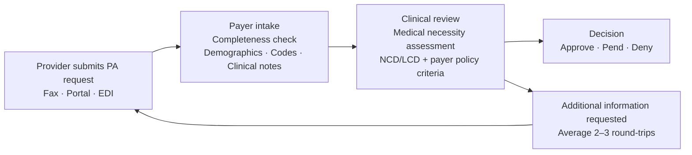

# Prior Authorization Review — Multi-Agent Solution Accelerator

A **multi-agent** AI-assisted prior authorization (PA) review application built
with the **Microsoft Agent Framework**, **Claude Agent SDK**, and **Anthropic
& DeepSense Healthcare MCP Servers**. Three specialized agents — Compliance, Clinical
Reviewer, and Coverage — work in parallel and sequence, coordinated by an
orchestrator that applies a gate-based decision rubric and produces a final
recommendation with confidence scoring and an audit justification document.

Incorporates best practices from the
[Anthropic prior-auth-review-skill](https://github.com/anthropics/healthcare/tree/main/prior-auth-review-skill):
LENIENT mode decision policy, per-criterion MET/NOT_MET/INSUFFICIENT evaluation,
confidence scoring, progressive gate evaluation, and structured audit trails.

<div align="center">

[**SOLUTION OVERVIEW**](#solution-overview) \| [**BUSINESS SCENARIO**](#business-scenario) \| [**QUICK DEPLOY**](#quick-deploy) \| [**SUPPORTING DOCUMENTATION**](#supporting-documentation)

</div>

> **Disclaimer:** This is an AI-assisted triage tool. All recommendations are
> drafts that require human clinical review before any authorization decision
> is finalized. Coverage policies reflect Medicare LCDs/NCDs only — commercial
> and Medicare Advantage plans may differ.

> **Solution Accelerator Notice:** This project is a **solution accelerator** —
> not a production-ready application. It is designed as a reference architecture
> and working prototype that customers can use as a starting point to build,
> customize, and extend their own prior authorization solution based on their
> specific requirements. Microsoft does not provide production support for this
> accelerator. Customers are responsible for testing, validation, regulatory
> compliance, and production deployment within their own environment.

---

##  Solution overview

This solution leverages **Microsoft AI Foundry**, **Microsoft Agent Framework**,
**Claude Agent SDK**, **Azure Application Insights**, and **Anthropic &
DeepSense Healthcare MCP Servers** to create an intelligent prior authorization review pipeline where
specialized AI agents work together to validate, assess, and synthesize PA
decisions with full audit transparency.


*The Prior Authorization Review interface showing the PA request form with patient demographics, diagnosis/procedure codes, clinical notes, and the "Load Sample Case" option for demo use.*

### Solution architecture


### Agentic architecture

The orchestrator coordinates four phases with three specialized agents:


### Key features

<details open>
  <summary><b>Multi-agent parallel execution</b></summary>

  - Compliance and Clinical agents run concurrently via `asyncio.gather`, reducing wall-clock time from 20+ minutes to under 2 minutes per case
  - Coverage Agent runs sequentially after clinical findings are available
  - Four-phase pipeline: Pre-flight → Parallel → Sequential → Synthesis → Audit
</details>

<details>
  <summary><b>Skills-based architecture</b></summary>

  - Agent behaviors defined in SKILL.md files — domain experts can update clinical rules without code changes
  - Dual-mode support: skills-based (default) or prompt-based (fallback), controlled by `USE_SKILLS` env var
  - Shared reference files for decision policy rubric and JSON output schemas
</details>

<details>
  <summary><b>MCP-powered data access</b></summary>

  - Five remote MCP servers: NPI Registry, ICD-10 Codes, CMS Coverage, Clinical Trials (DeepSense), PubMed (Anthropic)
  - No custom MCP client needed — Microsoft Agent Framework's Claude SDK handles it natively
  - Model-agnostic: `MCPStreamableHTTPTool` enables MCP access from any LLM
</details>

<details>
  <summary><b>Gate-based decision rubric</b></summary>

  - Three sequential gates: Provider → Codes → Medical Necessity
  - LENIENT mode: only APPROVE or PEND — never DENY
  - Per-criterion MET/NOT_MET/INSUFFICIENT assessment with confidence scoring
  - Configurable: switch to STRICT mode (adds DENY) via configuration toggle
</details>

<details>
  <summary><b>Human-in-the-loop decision panel</b></summary>

  - Accept or Override the AI recommendation with documented rationale
  - Override traceability: flows to notification letters, audit PDF, and API response
  - Authorization number generation (PA-YYYYMMDD-XXXXX)
  - PDF notification letters (approval and pend) with clinical justification data
</details>

<details>
  <summary><b>Audit and compliance</b></summary>

  - 8-section audit justification document (Markdown + color-coded PDF)
  - Per-criterion confidence scoring with weighted formula
  - Complete data source attribution and timestamp tracking
  - Diagnosis-Policy Alignment as a required auditable criterion
  - Section 9 added on clinician override with full override record
</details>

<details>
  <summary><b>Real-time progress streaming</b></summary>

  - SSE (Server-Sent Events) for live progress updates
  - Phase timeline with per-agent status cards and elapsed timer
  - 9 progress events across 5 phases (preflight → phase_1 → phase_2 → phase_3 → phase_4)
</details>

<details>
  <summary><b>Observability</b></summary>

  - Azure Application Insights integration via OpenTelemetry
  - Custom phase spans with semantic attributes (recommendation, confidence, agent status)
  - Foundry agent registration for centralized fleet management
  - Application Map, Transaction Search, Live Metrics, and Performance views
</details>

### Additional resources

- [Anthropic Healthcare MCP Marketplace](https://github.com/anthropics/healthcare)
- [Prior Auth Review Skill](https://github.com/anthropics/healthcare/tree/main/prior-auth-review-skill)
- [Build AI Agents with Claude Agent SDK and Microsoft Agent Framework](https://devblogs.microsoft.com/semantic-kernel/build-ai-agents-with-claude-agent-sdk-and-microsoft-agent-framework/)
- [Microsoft Agent Framework — Claude Agent](https://learn.microsoft.com/en-us/agent-framework/user-guide/agents/agent-types/anthropic-agent)
- [Microsoft AI Foundry Claude Models](https://learn.microsoft.com/en-us/azure/ai-foundry/foundry-models/how-to/use-foundry-models-claude)
- [Claude Prior Auth Review Tutorial](https://claude.com/resources/tutorials/how-to-use-the-prior-auth-review-sample-skill-with-claude-2ggy8)
- [Model Context Protocol (MCP)](https://modelcontextprotocol.io/)
- [Claude Agent SDK](https://platform.claude.com/docs/en/agent-sdk/overview)
- [Anthropic Agent Skills](https://platform.claude.com/docs/en/docs/agents-and-tools/agent-skills/overview)

---

##  Business Scenario

### What is prior authorization?

**Prior authorization (PA)** — also called pre-certification or pre-approval — is a
utilization management process required by health insurance payers before they agree
to cover a prescribed medical service, procedure, or medication. The treating
provider must demonstrate that the requested service is **medically necessary** and
meets the payer's **coverage policy criteria** before care is delivered.



### Industry challenges

| Challenge | Impact |
|-----------|--------|
| **Volume** | U.S. providers submit **~400 million PA requests per year** (AMA, 2024). Large payers process 50,000–200,000+ requests daily. |
| **Manual effort** | Each request takes **20–45 minutes** of clinician and administrative time. |
| **Turnaround delays** | Average PA decision takes **5–14 business days**, with complex cases exceeding 30 days. |
| **Administrative burden** | 88% of physicians report PA burdens are "high" or "extremely high" (AMA 2023). Practices spend **13 hours/week** on PA. |
| **Inconsistency** | Manual reviews are subject to reviewer variability and incomplete documentation assessment. |
| **Regulatory pressure** | CMS Final Rule (CMS-0057-F) mandates electronic PA by 2026, with 72-hour (urgent) and 7-day (standard) response limits. |

### How this solution addresses these challenges

| # | Challenge | Solution |
|---|-----------|----------|
| 1 | **Manual intake triage** | **Compliance Agent** validates all required documentation in seconds — patient demographics, provider credentials, codes, clinical notes quality |
| 2 | **Slow clinical review** | **Clinical Reviewer Agent** extracts and structures clinical data, validates ICD-10 codes, searches PubMed and clinical trials — work that takes a human 15-30 minutes done in under a minute |
| 3 | **Manual policy lookup** | **Coverage Agent** verifies provider credentials, searches NCDs/LCDs, and maps each criterion to clinical evidence with auditable MET/NOT_MET/INSUFFICIENT assessments |
| 4 | **Lack of transparency** | **Synthesis Agent** evaluates a gate-based rubric producing a recommendation with full audit trail — every data source, every criterion, every confidence score |
| 5 | **No human oversight** | **Decision Panel** — AI produces a draft recommendation; human reviewers Accept or Override with documented rationale |
| 6 | **Missing audit artifacts** | System generates **notification letters** (PDF), **audit justification documents** (8-section PDF), and structured data for EDI integration |

### Adoption at scale

| Capability | How It Enables Scale |
|-----------|---------------------|
| **Parallel agent execution** | Compliance and Clinical agents run concurrently, reducing wall-clock time from 20+ minutes to under 2 minutes per case |
| **Skills-based architecture** | Agent behaviors defined in SKILL.md files — domain experts can update rules without code changes |
| **MCP-based data access** | Standardized MCP servers for NPI, ICD-10, CMS Coverage, PubMed, and Clinical Trials provide modular, swappable integrations |
| **Configurable decision policy** | LENIENT mode (APPROVE/PEND) ships as default; STRICT mode (adding DENY) is a configuration toggle |
| **Container-ready deployment** | Docker Compose for dev, with a clear path to Azure Container Apps or Kubernetes |
| **Stateless API design** | Each review is independent — horizontally scalable behind a load balancer |
| **Audit and compliance** | Every review produces a complete audit trail with data source attribution and confidence breakdowns |
| **Multi-payer extensibility** | Architecture supports adding payer-specific policy engines and commercial coverage databases |

---

##  Quick deploy

### Prerequisites

- **Python 3.11+**
- **Node.js 18+**
- **Microsoft AI Foundry account** with access to Claude models
- Microsoft AI Foundry API key and endpoint

### 1. Clone the repository

```bash
git clone https://github.com/amitmukh/prior-auth-maf.git
cd prior-auth-maf
```

### 2. Backend setup

```bash
cd backend

# Create and activate virtual environment
python -m venv .venv
# Windows:
.venv\Scripts\activate
# macOS/Linux:
source .venv/bin/activate

# Install dependencies
pip install -r requirements.txt

# Configure environment
cp .env.example .env
```

Edit `.env` and set your Microsoft AI Foundry credentials:

```env
AZURE_FOUNDRY_API_KEY=your-azure-foundry-api-key
AZURE_FOUNDRY_ENDPOINT=https://your-endpoint.services.ai.azure.com
CLAUDE_MODEL=claude-sonnet-4-6

# Skills-based approach (default: true)
USE_SKILLS=true

# Azure Application Insights (optional)
APPLICATION_INSIGHTS_CONNECTION_STRING=InstrumentationKey=...;IngestionEndpoint=...
```

The MCP server endpoints are pre-configured with defaults:
four [DeepSense](https://mcp.deepsense.ai) servers (NPI Registry, ICD-10 Codes,
CMS Coverage, Clinical Trials) and one
[Anthropic](https://github.com/anthropics/healthcare) server (PubMed).

### 3. Frontend setup

```bash
cd frontend
npm install

# Configure environment (optional — defaults work for local dev)
cp .env.example .env.local
```

### 4. Run the application

Start both servers (in separate terminals):

**Backend** (runs on port 8000):
```bash
cd backend
uvicorn app.main:app --reload
```

**Frontend** (runs on port 3000):
```bash
cd frontend
cp .env.example .env.local   # sets NEXT_PUBLIC_API_BASE=http://localhost:8000/api
npm run dev
```

Open `http://localhost:3000` in your browser.

> **Note:** The frontend calls the backend directly (not through a Next.js
> rewrite proxy) because multi-agent reviews take 3-5 minutes — longer than
> the dev server proxy's default timeout.

### Docker Compose

```bash
# Build and start both containers
docker compose up --build

# App available at http://localhost:3000
# Backend health check at http://localhost:8000/health
```

The `docker-compose.yml` reads your `backend/.env` file and maps credentials:

| Your `.env` variable | Maps to (container) | Purpose |
|----------------------|---------------------|---------|
| `AZURE_FOUNDRY_API_KEY` | `ANTHROPIC_FOUNDRY_API_KEY` | Microsoft AI Foundry auth |
| `AZURE_FOUNDRY_ENDPOINT` | `ANTHROPIC_FOUNDRY_BASE_URL` | Foundry endpoint URL |
| (set automatically) | `CLAUDE_CODE_USE_FOUNDRY=true` | Enables Foundry mode |

<details>
  <summary><b>Building without local Docker (Azure Container Registry)</b></summary>

  ```bash
  # Create a container registry (one-time)
  az acr create --name priorauthacr --resource-group <rg> --sku Basic

  # Build images in the cloud
  az acr build --registry priorauthacr \
    --image prior-auth-backend:latest \
    --file backend/Dockerfile ./backend

  az acr build --registry priorauthacr \
    --image prior-auth-frontend:latest \
    --file frontend/Dockerfile ./frontend
  ```
</details>

<details>
  <summary><b>Deploying to Azure Container Apps</b></summary>

  ```bash
  # Create Container Apps environment
  az containerapp env create \
    --name prior-auth-env \
    --resource-group <rg> \
    --location <region>

  # Deploy backend
  az containerapp create \
    --name prior-auth-backend \
    --resource-group <rg> \
    --environment prior-auth-env \
    --image <acr-name>.azurecr.io/prior-auth-backend:latest \
    --target-port 8000 \
    --ingress internal \
    --min-replicas 1 \
    --env-vars \
      CLAUDE_CODE_USE_FOUNDRY=true \
      ANTHROPIC_FOUNDRY_API_KEY=secretref:foundry-key \
      ANTHROPIC_FOUNDRY_BASE_URL=https://<resource>.services.ai.azure.com/anthropic \
      FRONTEND_ORIGIN=https://prior-auth-frontend.<region>.azurecontainerapps.io

  # Deploy frontend
  az containerapp create \
    --name prior-auth-frontend \
    --resource-group <rg> \
    --environment prior-auth-env \
    --image <acr-name>.azurecr.io/prior-auth-frontend:latest \
    --target-port 80 \
    --ingress external \
    --min-replicas 1
  ```

  > Update `nginx.conf` to proxy `/api` to the backend Container App's
  > internal FQDN instead of `http://backend:8000`.
</details>

---

##  Supporting documentation

| Document | Description |
|----------|-------------|
| [Architecture](./docs/architecture.md) | Detailed multi-agent architecture, MCP integration, agent details, decision rubric, confidence scoring, audit justification, skills-based architecture |
| [API Reference](./docs/api-reference.md) | Full REST API documentation — all endpoints, request/response schemas, SSE events, error codes |
| [Extending the Application](./docs/extending.md) | Step-by-step guides for adding new agents, MCP servers, changing the decision rubric, customizing notification letters |
| [Technical Notes](./docs/technical-notes.md) | Windows SDK patches, MCP header injection, structured output, prompt caching, observability, Foundry agent registration, known limitations |
| [Troubleshooting](./docs/troubleshooting.md) | Common issues and fixes — CLI failures, empty responses, connection errors, truncated responses, Foundry trace issues |
| [Production Migration](./docs/production-migration.md) | PostgreSQL schema, Azure Blob Storage layout, migration steps, environment variables, what not to change |

### Project structure

```
prior-auth-maf/
├── backend/
│   ├── .env                              # Environment config (not committed)
│   ├── requirements.txt                  # Python dependencies
│   ├── run.py                            # Dev server launcher
│   ├── .claude/
│   │   ├── skills/
│   │   │   ├── compliance-review/SKILL.md
│   │   │   ├── clinical-review/SKILL.md
│   │   │   ├── coverage-assessment/SKILL.md
│   │   │   └── synthesis-decision/SKILL.md
│   │   └── references/
│   │       ├── rubric.md                 # Decision policy rubric
│   │       └── output-formats.md         # JSON output schemas
│   └── app/
│       ├── main.py                       # FastAPI app, CORS, router mounts
│       ├── config.py                     # Settings (API keys, MCP endpoints)
│       ├── observability.py              # Azure App Insights + OpenTelemetry
│       ├── patches/
│       │   └── __init__.py               # Windows Claude SDK patches
│       ├── agents/
│       │   ├── compliance_agent.py       # Compliance Agent (no tools)
│       │   ├── clinical_agent.py         # Clinical Reviewer Agent (3 MCP servers)
│       │   ├── coverage_agent.py         # Coverage Agent (2 MCP servers)
│       │   └── orchestrator.py           # Multi-agent coordinator + synthesis
│       ├── services/
│       │   ├── audit_pdf.py              # Audit justification PDF (fpdf2)
│       │   ├── cpt_validation.py         # CPT/HCPCS format validation
│       │   └── notification.py           # Notification letters + PDF
│       ├── tools/
│       │   └── mcp_config.py             # MCP server configs + headers
│       ├── models/
│       │   └── schemas.py                # Pydantic models
│       └── routers/
│           ├── review.py                 # POST /api/review + SSE streaming
│           └── decision.py               # POST /api/decision
│
├── frontend/
│   ├── package.json                      # Next.js 16 + shadcn/ui + Tailwind
│   ├── app/
│   │   └── page.tsx                      # Main page (form + dashboard)
│   ├── components/
│   │   ├── upload-form.tsx               # PA request form + sample case
│   │   ├── progress-tracker.tsx          # Real-time agent progress
│   │   ├── review-dashboard.tsx          # Results + confidence + gaps
│   │   ├── agent-details.tsx             # Tabbed per-agent breakdown
│   │   └── decision-panel.tsx            # Accept/Override + PDF download
│   └── lib/
│       ├── api.ts                        # Backend API client
│       ├── types.ts                      # TypeScript types
│       └── sample-case.ts                # Demo case data
│
├── docs/                                 # Supporting documentation
├── docker-compose.yml                    # Two-container local dev
└── README.md                             # This file
```

---

## Customization areas

This solution accelerator is designed to be extended:

| Area | What to customize | Guide |
|------|-------------------|-------|
| **Data persistence** | Replace in-memory store with PostgreSQL / Cosmos DB | [Production Migration](./docs/production-migration.md) |
| **Authentication** | Add identity management and RBAC | Custom implementation |
| **Payer-specific policies** | Extend with commercial and MA plan rules | [Extending](./docs/extending.md) |
| **EHR/EMR integration** | Connect via FHIR or HL7 interfaces | Custom implementation |
| **New agents** | Add Pharmacy Benefits, Financial Review, etc. | [Extending](./docs/extending.md) |
| **New MCP servers** | Add CPT validator, drug formulary, etc. | [Extending](./docs/extending.md) |
| **Decision rubric** | Switch from LENIENT to STRICT mode | [Extending](./docs/extending.md) |
| **Notification letters** | Match your organization's letterhead format | [Extending](./docs/extending.md) |
| **Compliance & security** | HIPAA-compliant infrastructure, encryption | Custom implementation |
| **Scalability** | Azure Container Apps, Kubernetes | [Quick Deploy](#quick-deploy) |

---

## Responsible AI Transparency FAQ
Please refer to [Transparency FAQ](./docs/TRANSPARENCY_FAQ.md) for responsible AI transparency details of this solution accelerator.

## Disclaimers
This release is an artificial intelligence (AI) system that generates text based on user input. The text generated by this system may include ungrounded content, meaning that it is not verified by any reliable source or based on any factual data. The data included in this release is synthetic, meaning that it is artificially created by the system and may contain factual errors or inconsistencies. Users of this release are responsible for determining the accuracy, validity, and suitability of any content generated by the system for their intended purposes. Users should not rely on the system output as a source of truth or as a substitute for human judgment or expertise.

This release only supports English language input and output. Users should not attempt to use the system with any other language or format. The system output may not be compatible with any translation tools or services, and may lose its meaning or coherence if translated.

This release does not reflect the opinions, views, or values of Microsoft Corporation or any of its affiliates, subsidiaries, or partners. The system output is solely based on the system's own logic and algorithms, and does not represent any endorsement, recommendation, or advice from Microsoft or any other entity. Microsoft disclaims any liability or responsibility for any damages, losses, or harms arising from the use of this release or its output by any user or third party.

This release does not provide any financial advice, legal advice and is not designed to replace the role of qualified client advisors in appropriately advising clients. Users should not use the system output for any financial decisions, legal guidance or transactions, and should consult with a professional financial  advisor and or legal advisor as appropriate before taking any action based on the system output. Microsoft is not a financial institution or a fiduciary, and does not offer any financial products or services through this release or its output.

This release is intended as a proof of concept only, and is not a finished or polished product. It is not intended for commercial use or distribution, and is subject to change or discontinuation without notice. Any planned deployment of this release or its output should include comprehensive testing and evaluation to ensure it is fit for purpose and meets the user's requirements and expectations. Microsoft does not guarantee the quality, performance, reliability, or availability of this release or its output, and does not provide any warranty or support for it.

This Software requires the use of third-party components which are governed by separate proprietary or open-source licenses as identified below, and you must comply with the terms of each applicable license in order to use the Software. You acknowledge and agree that this license does not grant you a license or other right to use any such third-party proprietary or open-source components.

To the extent that the Software includes components or code used in or derived from Microsoft products or services, including without limitation Microsoft Azure Services (collectively, "Microsoft Products and Services"), you must also comply with the Product Terms applicable to such Microsoft Products and Services. You acknowledge and agree that the license governing the Software does not grant you a license or other right to use Microsoft Products and Services. Nothing in the license or this ReadMe file will serve to supersede, amend, terminate or modify any terms in the Product Terms for any Microsoft Products and Services.

You must also comply with all domestic and international export laws and regulations that apply to the Software, which include restrictions on destinations, end users, and end use. For further information on export restrictions, visit https://aka.ms/exporting.

You acknowledge that the Software and Microsoft Products and Services (1) are not designed, intended or made available as a medical device(s), and (2) are not designed or intended to be a substitute for professional medical advice, diagnosis, treatment, or judgment and should not be used to replace or as a substitute for professional medical advice, diagnosis, treatment, or judgment. Customer is solely responsible for displaying and/or obtaining appropriate consents, warnings, disclaimers, and acknowledgements to end users of Customer's implementation of the Online Services.

You acknowledge the Software is not subject to SOC 1 and SOC 2 compliance audits. No Microsoft technology, nor any of its component technologies, including the Software, is intended or made available as a substitute for the professional advice, opinion, or judgment of a certified financial services professional. Do not use the Software to replace, substitute, or provide professional financial advice or judgment.

BY ACCESSING OR USING THE SOFTWARE, YOU ACKNOWLEDGE THAT THE SOFTWARE IS NOT DESIGNED OR INTENDED TO SUPPORT ANY USE IN WHICH A SERVICE INTERRUPTION, DEFECT, ERROR, OR OTHER FAILURE OF THE SOFTWARE COULD RESULT IN THE DEATH OR SERIOUS BODILY INJURY OF ANY PERSON OR IN PHYSICAL OR ENVIRONMENTAL DAMAGE (COLLECTIVELY, "HIGH-RISK USE"), AND THAT YOU WILL ENSURE THAT, IN THE EVENT OF ANY INTERRUPTION, DEFECT, ERROR, OR OTHER FAILURE OF THE SOFTWARE, THE SAFETY OF PEOPLE, PROPERTY, AND THE ENVIRONMENT ARE NOT REDUCED BELOW A LEVEL THAT IS REASONABLY, APPROPRIATE, AND LEGAL, WHETHER IN GENERAL OR IN A SPECIFIC INDUSTRY. BY ACCESSING THE SOFTWARE, YOU FURTHER ACKNOWLEDGE THAT YOUR HIGH-RISK USE OF THE SOFTWARE IS AT YOUR OWN RISK.
